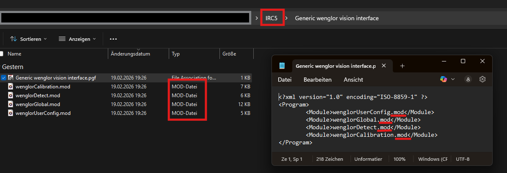
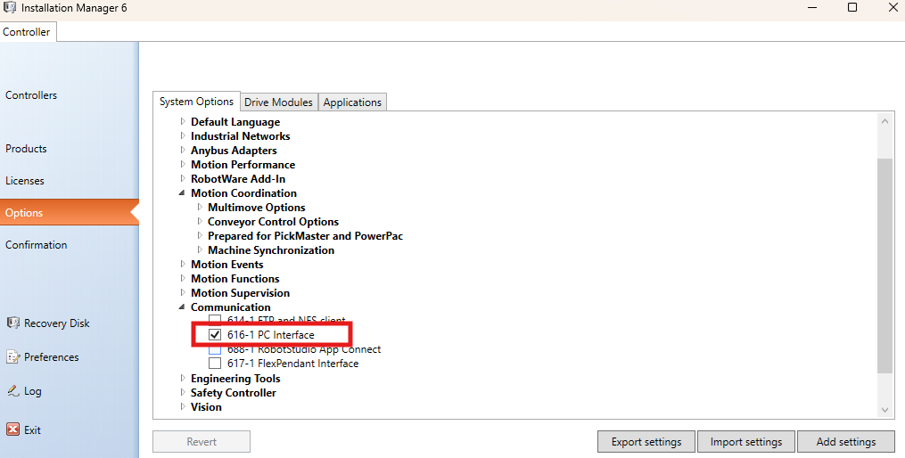
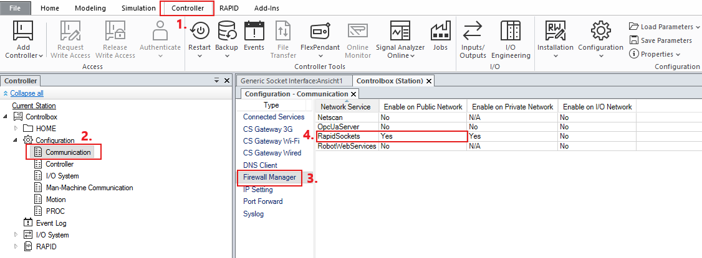
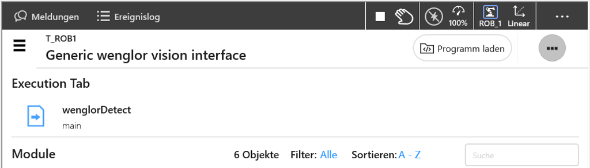

# Installation & Setup

The robot vision example for ABB consists of the following files, available in the [sources](https://github.com/wenglor/robot-vision-abb/tree/main/sources) directory of this repository:

| File | Contents |
| --- | --- |
| `Generic wenglor vision interface.pgf` | Program file that references the modules below. |
| `wenglorUserConfig.modx` | User configuration (IP, port, poses, jobs, use case). |
| `wenglorGlobal.modx` | Core and helper functions (socket communication, conversions). |
| `wenglorCalibration.modx` | Hand-eye calibration and verification. |
| `wenglorDetect.modx` | Object detection and movement to detected objects. |

Copy these files to the robot controller, e.g. to `/HOME` or `/HOME/<project_folder>`.

## Supported controllers

| Controller | Minimum software version | Additional steps |
| --- | --- | --- |
| OmniCore | RobotWare 7.3.2 | None — run the `.modx` files as-is. |
| IRC5 | RobotWare 5.15 | Rename the module files from `.modx` to `.mod`, update the corresponding references within the PGF file, and activate the **PC Interface** option. |

## Network configuration in RobotStudio

In the ABB software **RobotStudio**, adjust the network settings of the ABB robot controller for the public network and make sure that **RapidSockets** is set to `YES` (Communication → Firewall Manager).

> NOTE
>
> On the Machine Vision Device website (Tab `Jobs` → `Robot Server`), make sure the robot server is active and the robot manufacturer is set to **ABB**. See [Settings on Device Website](https://wenglor.github.io/robot-vision-generic-string/4_0_robot_vision_server/4_3_0_settings_on_device_website/) in the wenglor robot vision manual.

## Loading the program

Adjust the parameters in `wenglorUserConfig.modx` to match your setup — see [User Configuration](../2_0_user_configuration/index.md). Once the user configuration is updated, load the program **Generic wenglor vision interface**. It is then ready to be executed.

> NOTE
>
> For details about the communication to the robot server, see [Generic Robot Vision API](https://wenglor.github.io/robot-vision-generic-string/4_0_robot_vision_server/4_7_0_generic_robot_vision_interface/) in the wenglor robot vision manual.
