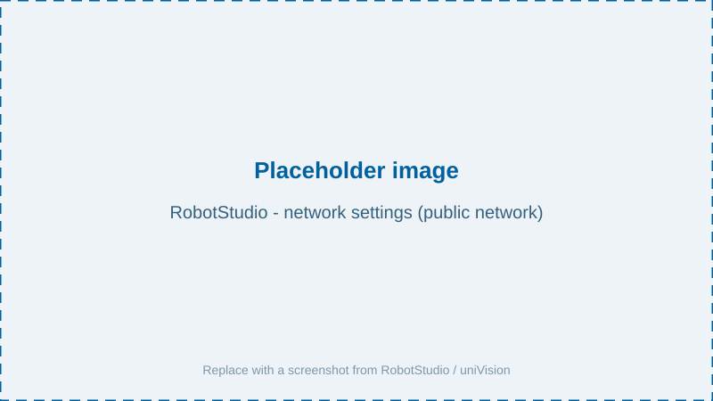
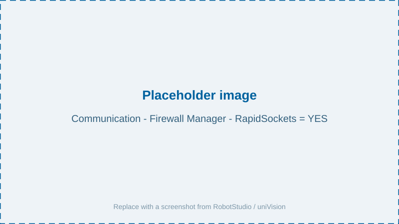
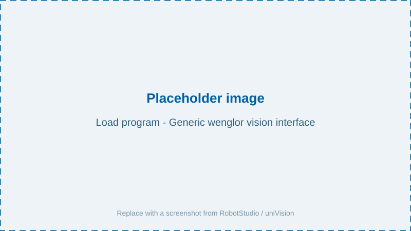

# Installation & Setup

The ABB robot vision example is a set of RAPID modules bundled in a program file (`.pgf`). Before loading it, prepare the robot controller and the network connection to the Machine Vision Device.

## Supported controllers

| Controller | Minimum software version | Notes |
| --- | --- | --- |
| OmniCore | RobotWare 7.3.2 | Runs the `.modx` files directly. |
| IRC5 | RobotWare 5.15 | Rename module files from `.modx` to `.mod`, adjust the references inside the `.pgf` file accordingly, and activate the option **PC Interface**. |

## Files

Download the robot example from [www.wenglor.com/product/DNNF023](https://www.wenglor.com/product/DNNF023) → Downloads → Programming examples and configuration files → Examples_Robot_Vision. It consists of:

- `Generic wenglor vision interface.pgf` — the program file that references the modules.
- `wenglorUserConfig.modx` — user configuration (IP, port, poses, jobs, use case). See [User Configuration](../2_0_user_configuration/index.md).
- `wenglorGlobal.modx` — core and helper functions (socket communication, conversions).
- `wenglorCalibration.modx` — hand-eye calibration and verification.
- `wenglorDetect.modx` — object detection and movement to detected objects.

## Network configuration in RobotStudio

In the ABB software **RobotStudio**, adjust the network settings of the ABB robot controller for the public network so it can reach the Machine Vision Device (by default `192.168.100.1`).

Make sure that **RapidSockets** is set to `YES` (Communication → Firewall Manager). Without this setting, the socket communication used by the example will not work.

> NOTE
>
> On the Machine Vision Device website (Tab `Jobs` → `Robot Server`), make sure the robot server is active and the robot manufacturer is set to **ABB**. See [Settings on Device Website](https://wenglor.github.io/wenglor-robot-vision/4_0_robot_vision_server/4_2_0_settings_on_device_website/) in the wenglor robot vision manual.

## Loading the program

After updating the [user configuration](../2_0_user_configuration/index.md) to match your setup, load the program **Generic wenglor vision interface**. The program is then ready to be executed.

