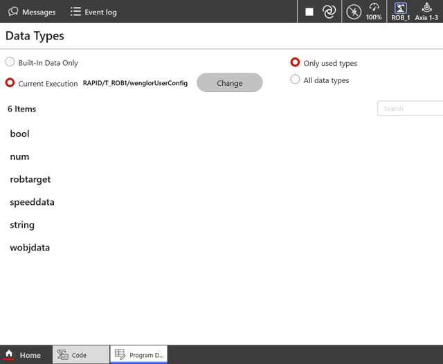

# 2. User Configuration

Adjust the parameters in `wenglorUserConfig.modx` according to your needs.



## Boolean parameters (`bool`)

/// html | div.col-widths
    attrs: {style: "--w1: 30%; --w2: 70%;"}

| Parameter | Description |
| --- | --- |
| `W_MACHINE_POSES_TAUGHT` | Used within the `updateReferenceFrame` use case to stop the program, so the related poses for the reference frame can be taught after the initial reference frame was set. After teaching the poses, set this value to `TRUE`. |
///

## Numerical parameters (`num`)

/// html | div.col-widths
    attrs: {style: "--w1: 25%; --w2: 75%;"}

| Parameter | Description |
| --- | --- |
| `W_SAFETY_OFFSET_MM` | Specifies the Z offset in millimeters for the validation of the calibration. |
| `W_VISION_DEVICE_PORT` | Specifies the communication port for the Machine Vision Device (by default `32006`). |
///

## Position data (`robtarget`)

/// html | div.col-widths
    attrs: {style: "--w1: 25%; --w2: 75%;"}

| Parameter | Description |
| --- | --- |
| `wCalibPose1` to `wCalibPose5` | Defines the calibration poses. For details, see [Robot Program → Calibration](3_0_0_robot_program.md#calibration) and the [Wenglor Robot Server overview](https://wenglor.github.io/robot-vision-generic-string/5_1_0_basics_with_robot_server/) in the wenglor robot vision manual. |
| `wDetectionPose` | Defines the detection pose for the object recognition. For **camera on robot**, the detection pose must be identical to the first calibration pose (handled automatically by the robot example program). For **camera not on robot**, the detection pose must be set separately so that the robot arm does not interfere with the camera image. This pose is used for the second calibration step and for the detection step. |
| `wPoseInMachine` | Dummy pose that is used to show the use case for `updateReferenceFrame` and how to use your poses there. This pose is set relative to `wReferenceFrame`. |
///

## Speed data (`speeddata`)

| Parameter | Description |
| --- | --- |
| `W_CALIB_SPEED` | Defines the speed settings during calibration (in mm/s). |

## String parameters (`string`)

/// html | div.col-widths
    attrs: {style: "--w1: 25%; --w2: 75%;"}

| Parameter | Description |
| --- | --- |
| `W_VISION_DEVICE_IP` | Defines the IP address of the Machine Vision Device (by default `192.168.100.1`). |
| `W_CALIBRATION_JOB` | Defines the name of the uniVision job for calibration. |
| `W_CALIBRATION_TARGET` | Defines the size of the calibration plate. Select `zvzj001` if using ZVZJ005 and select `zvzj002` if using ZVZJ006. |
| `W_DETECT_OBJECTS_JOB` | Defines the name of the uniVision job for detection. |
| `W_USE_CASE` | Defines if the camera is on the robot or not (e.g. `camera_on_robot` or `camera_not_on_robot`). |
| `W_DETECT_TARGET_JOB` | Defines the name of the uniVision job for detecting the calibration plate. |
| `W_USER_COMMAND` | Defines the routine to execute (`singleDetection`, `multiDetection` or `updateReferenceFrame`). |
///

## Reference frame parameters (`wobjdata`)

/// html | div.col-widths
    attrs: {style: "--w1: 25%; --w2: 75%;"}

| Parameter | Description |
| --- | --- |
| `wReferenceFrame` | The reference frame updated by the `updateReferenceFrame` routine. Teach all poses in the machine relative to this frame so they update together with it. For details, see the [Wenglor Robot Server overview](https://wenglor.github.io/robot-vision-generic-string/5_1_0_basics_with_robot_server/) in the wenglor robot vision manual. |
///

## Example

```rapid
!*********************************************** USER CONFIG ****************************************************!
! Replace IP address and port with your setup.
CONST string W_VISION_DEVICE_IP:="192.168.100.1";
CONST num W_VISION_DEVICE_PORT:=32006;

! Comment out the correct line depending on the selected camera/robot setup
CONST string W_USE_CASE:="camera_on_robot";
!CONST string W_USE_CASE := "camera_not_on_robot";

! Replace with the calibration target you are using
! Calibration target:
! "zvzj001" | "zvzj002" | "zvzj003" | "zvzj004" |
! "24x30mm" | "375x550mm" | "550x800mm"
! if you are using zvzj005, replace with zvzj001 and
! if you are using zvzj006, replace with zvzj002
CONST string W_CALIBRATION_TARGET:="zvzj001";
! Replace the calibration job with the one you created in uniVision
CONST string W_CALIBRATION_JOB:="calibration.u3p";
CONST string W_DETECT_OBJECTS_JOB:="find_objects.u3p";
CONST string W_DETECT_TARGET_JOB:="find_target.u3p";

CONST string W_USER_COMMAND:="singleDetection";
!CONST string W_USER_COMMAND:="multiDetection";
!CONST string W_USER_COMMAND:="updateReferenceFrame";

! Adjust validation z safety offset [mm]
CONST num W_SAFETY_OFFSET_MM:=10;

! Set speed for calibration movements here
CONST speeddata W_CALIB_SPEED:=v100;
```

!!! note

    Also check that **ABB** is selected in the robot manufacturer drop-down of the robot server on the Machine Vision Device website (e.g. B60, MVC). See [Settings on Device Website](https://wenglor.github.io/robot-vision-generic-string/5_2_0_settings_on_device_website/) in the wenglor robot vision manual.

    Once the configuration matches your setup, load the program "Generic wenglor vision interface" — see [Installation & Setup](1_0_0_installation.md).
