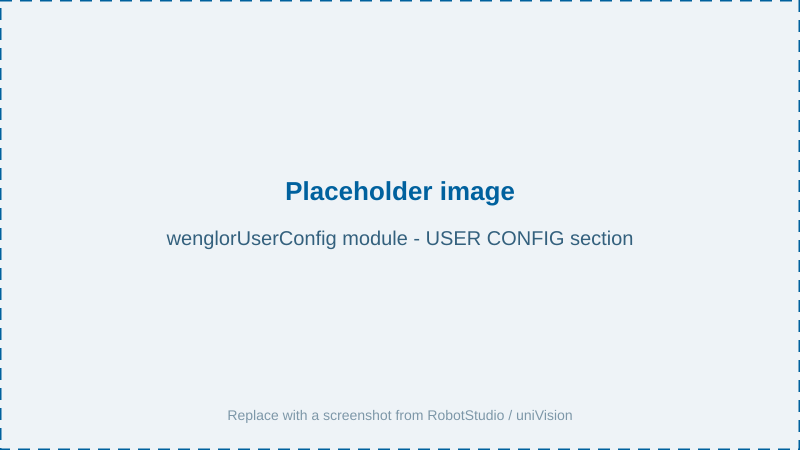
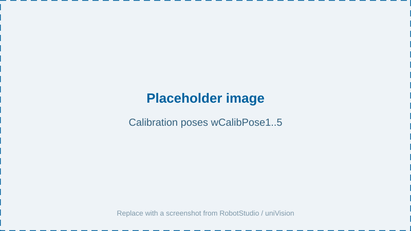

# User Configuration

All parameters you need to adapt to your setup are located in the `wenglorUserConfig.modx` module. Adjust them according to your needs before running the program.



## Boolean parameters (`bool`)

| Parameter | Description |
| --- | --- |
| `W_MACHINE_POSES_TAUGHT` | Used within the `updateReferenceFrame` use case to stop the program so the related poses for the reference frame can be taught after the initial reference frame was set. After teaching the poses, set this value to `TRUE`. |

## Numerical parameters (`num`)

| Parameter | Description |
| --- | --- |
| `W_SAFETY_OFFSET_MM` | Z offset in millimeters for the validation of the calibration. |
| `W_VISION_DEVICE_PORT` | Communication port for the Machine Vision Device (by default `32006`). |

## String parameters (`string`)

| Parameter | Description |
| --- | --- |
| `W_VISION_DEVICE_IP` | IP address of the Machine Vision Device (by default `192.168.100.1`). |
| `W_CALIBRATION_JOB` | Name of the uniVision job for calibration. |
| `W_CALIBRATION_TARGET` | Size of the calibration plate. Select `ZVZJ001` if using ZVZJ005 and `ZVZJ002` if using ZVZJ006. |
| `W_DETECT_OBJECTS_JOB` | Name of the uniVision job for detection. |
| `W_DETECT_TARGET_JOB` | Name of the uniVision job for detecting the calibration plate. |
| `W_USE_CASE` | Defines whether the camera is on the robot or not (`camera_on_robot` or `camera_not_on_robot`). |
| `W_USER_COMMAND` | The routine to execute (`singleDetection`, `multiDetection`, or `updateReferenceFrame`). |

## Position data (`robtarget`)



| Parameter | Description |
| --- | --- |
| `wCalibPose1` … `wCalibPose5` | The calibration poses. For details, see [Robot Program → Calibration](../3_0_robot_program/index.md#calibration). |
| `wDetectionPose` | The detection pose for object recognition. For **camera on robot**, the detection pose must be identical to the first calibration pose (handled automatically by the program). For **camera not on robot**, the detection pose must be set separately so that the robot arm does not interfere with the camera image. |
| `wPoseInMachine` | Dummy pose that demonstrates the `updateReferenceFrame` use case. This pose is set relative to `wReferenceFrame`. |

## Speed data (`speeddata`)

| Parameter | Description |
| --- | --- |
| `W_CALIB_SPEED` | Speed settings during calibration (in mm/s). |

## Reference frame parameters (`wobjdata`)

| Parameter | Description |
| --- | --- |
| `wReferenceFrame` | The reference frame that is updated by the `updateReferenceFrame` routine, and to which all machine poses shall be taught so they can be updated together with the reference frame. |

## Example

```rapid
!*********************************************** USER CONFIG ****************************************************!
! Replace IP address and port with your setup.
CONST string W_VISION_DEVICE_IP:="192.168.100.1";
CONST num W_VISION_DEVICE_PORT:=32006;

! Comment out the correct line depending on the selected camera/robot setup
CONST string W_USE_CASE:="camera_on_robot";
!CONST string W_USE_CASE := "camera_not_on_robot";

! Replace with the calibration target you are using
! if you are using zvzj005, replace with zvzj001 and
! if you are using zvzj006, replace with zvzj002
CONST string W_CALIBRATION_TARGET:="zvzj001";
! Replace the calibration job with the one you created in uniVision
CONST string W_CALIBRATION_JOB:="calibration.u3p";
CONST string W_DETECT_OBJECTS_JOB:="find_objects.u3p";
CONST string W_DETECT_TARGET_JOB:="find_target.u3p";

CONST string W_USER_COMMAND:="singleDetection";
!CONST string W_USER_COMMAND:="multiDetection";
!CONST string W_USER_COMMAND:="updateReferenceFrame";

! Adjust validation z safety offset [mm]
CONST num W_SAFETY_OFFSET_MM:=10;

! Set speed for calibration movements here
CONST speeddata W_CALIB_SPEED:=v100;
```

> NOTE
>
> Also check that **ABB** is selected in the robot manufacturer drop-down of the robot server on the Machine Vision Device website (e.g. B60, MVC). See [Settings on Device Website](https://wenglor.github.io/robot-vision-generic-string/4_0_robot_vision_server/4_2_0_settings_on_device_website/) in the wenglor robot vision manual.
