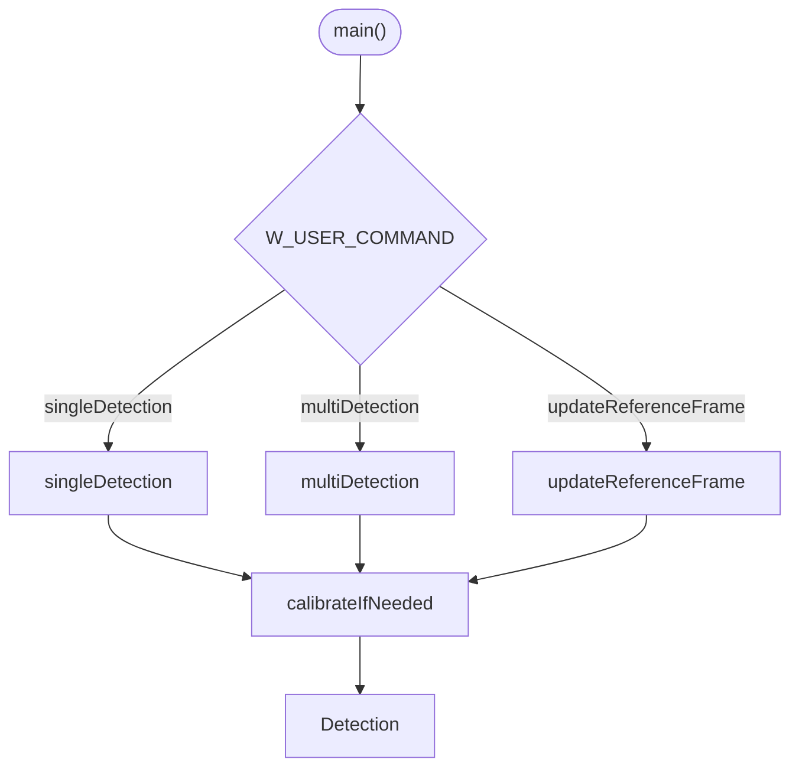
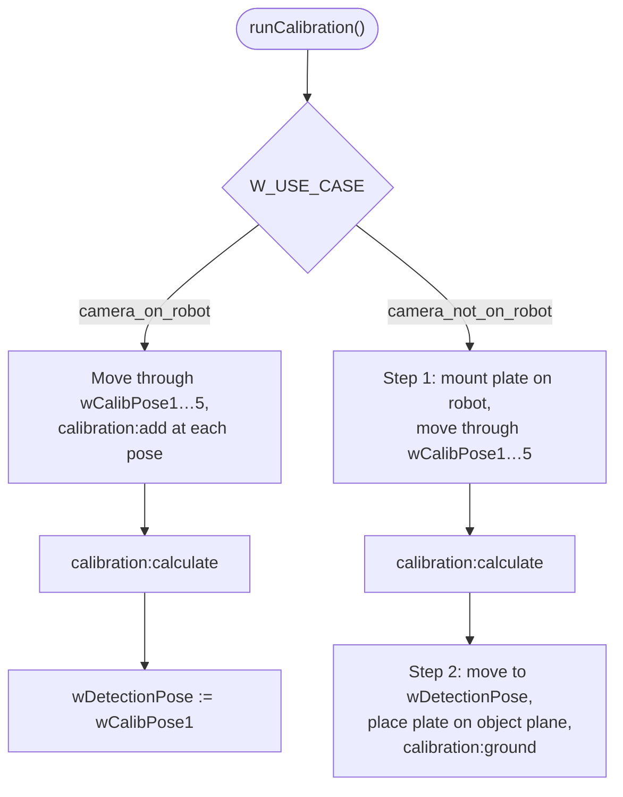
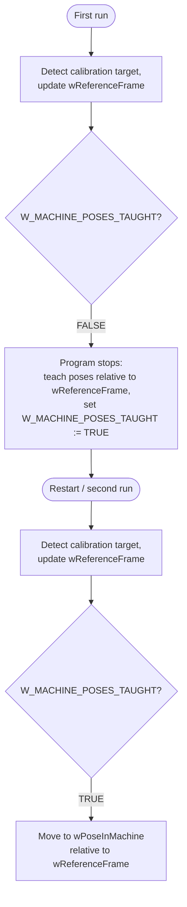

# 3. Robot Program

The example program implements a complete robot vision workflow: calibrating the camera to the robot, detecting objects, and moving to them. It is split into several RAPID modules referenced by the `Generic wenglor vision interface.pgf` program file.

## Modules

/// html | div.col-widths
    attrs: {style: "--w1: 25%; --w2: 75%;"}

| Module | Responsibility |
| --- | --- |
| `wenglorUserConfig` | All user-adjustable parameters. See [User Configuration](2_0_0_user_configuration.md). |
| `wenglorGlobal` | Socket communication helpers, pose/quaternion ↔ rotation-vector conversions, error handling. |
| `wenglorCalibration` | Hand-eye calibration and calibration verification. |
| `wenglorDetect` | Object detection at the detection pose and movement to detected objects. Contains `main()`. |
///

## Program flow

The program entry point is `main()` in `wenglorDetect`, which calls `callUserCommand()`. Depending on `W_USER_COMMAND`, one of three routines runs:

```rapid
PROC callUserCommand()
    IF (W_USER_COMMAND="singleDetection") THEN
        singleDetection;
    ELSEIF (W_USER_COMMAND="multiDetection") THEN
        multiDetection;
    ELSEIF (W_USER_COMMAND="updateReferenceFrame") THEN
        updateReferenceFrame;
    ENDIF
ENDPROC
```

Each routine first calls `calibrateIfNeeded`, which runs a calibration if no calibration data is available on the device yet.


/// html | div.col-widths
    attrs: {style: "--w1: 25%; --w2: 50%; --w3: 25%;"}

| `W_USER_COMMAND` | Use it when you want to… | Details |
| --- | --- | --- |
| `singleDetection` | Pick one object per detection. | [`singleDetection`](#singledetection) |
| `multiDetection` | Pick all objects found in one image. | [`multiDetection`](#multidetection) |
| `updateReferenceFrame` | Re-localize a machine, shelf, or mobile platform before picking. | [`updateReferenceFrame`](#updatereferenceframe) |
///

## Calibration

The robot and camera are calibrated using several calibration poses, in which the camera looks from different positions and angles at the calibration plate (hand-eye calibration). Use the recommended ZVZJ calibration plate, or print the corresponding PDF on flat, stiff material. The calibration is done inside the wenglor robot server, including the compensation of the lens distortion and the calculation in mm. The calibration process differs depending on whether the camera is mounted on the robot or not — the sections below describe only how the **ABB example** performs each case.

!!! note

    For the general calibration concepts — which calibration plate to use, how to choose and vary the poses, and how to read the reprojection error — see [5.1 Basics with Robot Server](https://wenglor.github.io/robot-vision-generic-string/5_1_0_basics_with_robot_server/) in the wenglor robot vision manual. The description here does not repeat them.

The poses are taught in `wenglorUserConfig.modx` (`wCalibPose1` … `wCalibPose5`); the example moves through them in `wenglorCalibration.runCalibration()`, calling `calibration:add` at each pose. For the most accurate results, make the difference between one pose and the next as large as possible — vary the pose angles as much as you can, since motions with non-parallel rotation axes give the best calibration. See the example calibration poses in [5.1.1 Camera on Robot](https://wenglor.github.io/robot-vision-generic-string/5_1_1_camera_on_robot/#calibration-use-case) and [5.1.2 Camera not on Robot](https://wenglor.github.io/robot-vision-generic-string/5_1_2_camera_not_on_robot/#calibration-use-case) in the wenglor robot vision manual.



### Camera on robot

If the camera is on the robot, teach a minimum of five calibration poses (e.g. seven to eleven poses for more accurate results). The first calibration pose is also the detection pose — choose one from which the objects can be reached safely. This is handled automatically by the program:

```rapid
IF (W_USE_CASE="camera_on_robot") THEN
    ! For the camera on robot case, the first calibration pose is also the wDetectionPose pose
    wDetectionPose:=wCalibPose1;
```

See [5.1.1 Camera on Robot](https://wenglor.github.io/robot-vision-generic-string/5_1_1_camera_on_robot/) in the wenglor robot vision manual for setup photos and calibration poses for this case.

### Camera not on robot

If the camera is not on the robot, the calibration process consists of two steps:

| Step | Action |
| --- | --- |
| 1 | Mount the calibration plate on the robot and teach a minimum of five calibration poses (e.g. seven to eleven poses for more accurate results). |
| 2 | Place the calibration plate on the measuring or picking plane and capture a single image. The robot first moves to `wDetectionPose` so it does not block the plate while the user places it. |

```rapid
ELSEIF (W_USE_CASE="camera_not_on_robot") THEN
    IF (wDetectionPose=emptyPose) THEN
        warningMessage("Exit program as wDetectionPose pose is not set.");
        EXIT;
    ENDIF
    ! Move to the detection pose so the user can place the calibration target on the ground
    MoveL wDetectionPose,v200,fine,currentToolValue;
    answer:= userDialog("Confirm when calibration target was placed on object ground.");
    IF (answer=resOK) THEN
        calibrateToGround;
```

See [5.1.2 Camera not on Robot](https://wenglor.github.io/robot-vision-generic-string/5_1_2_camera_not_on_robot/) in the wenglor robot vision manual for setup photos and calibration poses for this case.

### Verification

After calibration, `wenglorCalibration.validateCalibration()` performs an optional verification step to check the calibration's accuracy: it moves the robot TCP to the bottom left corner of the calibration plate, offset by the adjustable safety height `W_SAFETY_OFFSET_MM`. The calibration plate must not be moved between the calibration and the verification step. If the results look wrong, check the setup and re-run the calibration. See the verification photos in [5.1.1 Camera on Robot](https://wenglor.github.io/robot-vision-generic-string/5_1_1_camera_on_robot/#calibration-use-case) and [5.1.2 Camera not on Robot](https://wenglor.github.io/robot-vision-generic-string/5_1_2_camera_not_on_robot/#calibration-use-case) in the wenglor robot vision manual.

!!! note

    For the verification step, the Z-axis must point to the object plane. The reprojection error shows how good the calibration was. Typical values are 0.1 for ZVZJ calibration plates and 0.5 for printed calibration plates. See [5.1 Basics with Robot Server](https://wenglor.github.io/robot-vision-generic-string/5_1_0_basics_with_robot_server/) in the wenglor robot vision manual.

## Detection

After successful calibration, pick your objects. With the object position sent by the camera, the robot moves to the object pose. See the detection photos in [5.1.1 Camera on Robot](https://wenglor.github.io/robot-vision-generic-string/5_1_1_camera_on_robot/#detect-use-case) and [5.1.2 Camera not on Robot](https://wenglor.github.io/robot-vision-generic-string/5_1_2_camera_not_on_robot/#detect-use-case) in the wenglor robot vision manual.

### `singleDetection`

Loads the detection job, moves to the detection pose, requests a single object pose, reads its shape, and moves to it:

```rapid
PROC singleDetection()
    VAR robtarget objectPose;
    VAR string userValue;
    VAR num shape;

    GetSysData currentToolValue;

    IF (wDetectionPose=emptyPose) THEN
        warningMessage("Exit program as wDetectionPose pose is not set.");
        EXIT;
    ENDIF

    calibrateIfNeeded;
    loadJob(W_DETECT_OBJECTS_JOB);
    MoveL wDetectionPose,v200,fine,currentToolValue;
    objectPose:=detectObjects();
    shape:=readShapeByIndex(0);
    ! Link additional value in the uniVision job before using readValueByIndex.
    !userValue:=readValueByIndex(0);
    MoveL objectPose,v100,fine,currentToolValue;
ENDPROC
```

### `multiDetection`

Fills the camera-side buffer, reads the number of objects, and iterates over all detected objects:

```rapid
objectPose:=detectObjects();
numObjects:=readNumObjects();
FOR i FROM 0 TO numObjects-1 DO
    shape:=readShapeByIndex(i);
    objectPose:=readPoseByIndex(i);
    MoveL objectPose,v100,fine,currentToolValue;
ENDFOR
```

You can extend this with conditional checks on the shape model or additional value (link the additional value in the uniVision job before using `readValueByIndex`).

### `updateReferenceFrame`

Used for mobile platforms and similar use cases (e.g. to correct positional deviations of a mobile platform in front of a machine or shelf). It detects the calibration target, updates `wReferenceFrame`, and — once the machine poses have been taught relative to that frame — moves to them:

!!! note

    `detectTarget()` in `wenglorDetect` wraps the `target:pose` command. `wenglorCalibration` also provides `calibrateToTarget()`, wrapping `calibration:target`, to recalibrate the camera-to-target relation without writing a new calibration file — it is not called by any routine in this example, but is available for custom use cases. See [Target Pose and Camera-to-Target Calibration](https://wenglor.github.io/robot-vision-generic-string/5_5_0_target_pose_and_camera_to_target/) in the wenglor robot vision manual.

```rapid
targetPose:=detectTarget();
wReferenceFrame.uframe.trans := targetPose.trans;
wReferenceFrame.uframe.rot   := targetPose.rot;

IF (W_MACHINE_POSES_TAUGHT = FALSE) THEN
    infoMessage("Reference frame updated. Please teach poses now relative to wReferenceFrame");
    infoMessage("Set W_MACHINE_POSES_TAUGHT to TRUE and restart after teaching the poses.");
    EXIT;
ENDIF

MoveL wPoseInMachine,v200,fine,currentToolValue \WObj:=wReferenceFrame;
```

This routine is meant to run twice — once to establish the reference frame, once to use it:



## Units and conventions

The `wenglorGlobal` module converts between the ABB and the API conventions automatically:

- ABB works in **millimeters**; the API uses **meters**. Positions are converted on send/receive.
- ABB orientations are **quaternions**; the API uses a **rotation vector** (Rodrigues convention, in radians). Conversion is handled by `quatToRotVec` and `rotVecToQuat`.

!!! note

    The TCP request length is limited to 80 characters, so pose values sent to the camera are rounded to 3 decimals.
