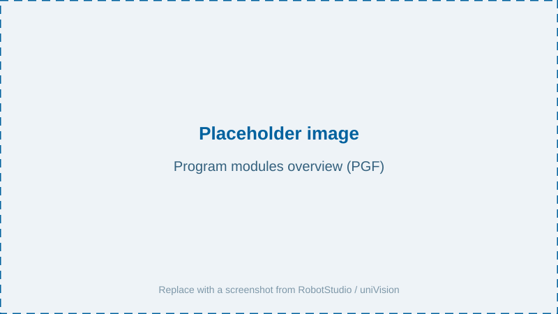
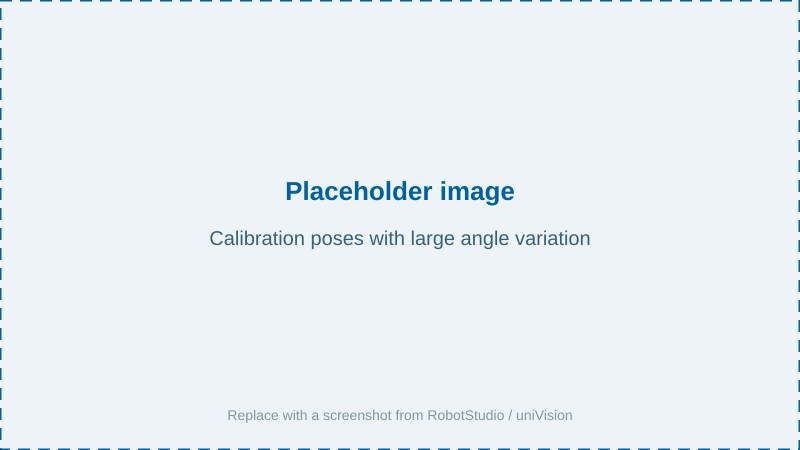
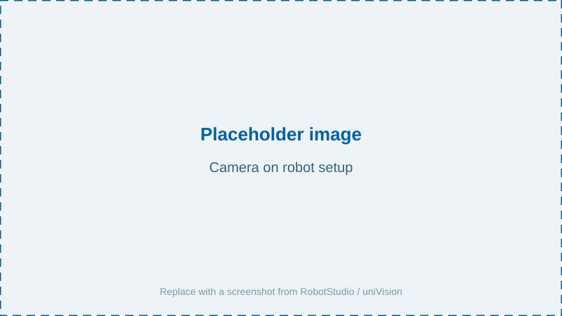
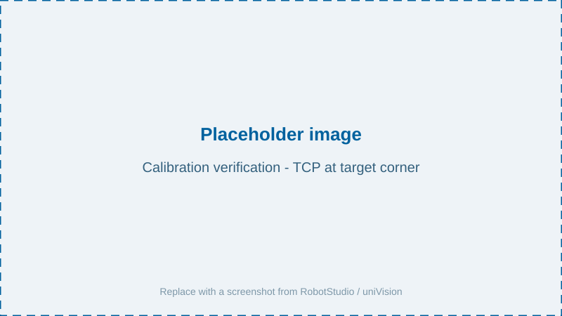
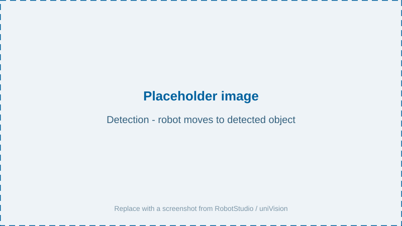

# Robot Program

The example program implements a complete robot vision workflow: calibrating the camera to the robot, detecting objects, and moving to them. It is split into several RAPID modules referenced by the `Generic wenglor vision interface.pgf` program file.



## Modules

| Module | Responsibility |
| --- | --- |
| `wenglorUserConfig` | All user-adjustable parameters. See [User Configuration](../2_0_user_configuration/index.md). |
| `wenglorGlobal` | Socket communication helpers, pose/quaternion ↔ rotation-vector conversions, error handling. |
| `wenglorCalibration` | Hand-eye calibration and calibration verification. |
| `wenglorDetect` | Object detection at the detection pose and movement to detected objects. Contains `main()`. |

## Program flow

The program entry point is `main()` in `wenglorDetect`, which calls `callUserCommand()`. Depending on `W_USER_COMMAND`, one of three routines runs:

```rapid
PROC callUserCommand()
    IF (W_USER_COMMAND="singleDetection") THEN
        singleDetection;
    ELSEIF (W_USER_COMMAND="multiDetection") THEN
        multiDetection;
    ELSEIF (W_USER_COMMAND="updateReferenceFrame") THEN
        updateReferenceFrame;
    ENDIF
ENDPROC
```

Each routine first calls `calibrateIfNeeded`, which runs a calibration if no calibration data is available on the device yet.

## Calibration

The calibration process differs depending on whether the camera is mounted on the robot or not. The sections below describe only how the **ABB example** performs each case.

> NOTE
>
> For the general calibration concepts — which calibration plate to use, how to choose and vary the poses, and how to read the reprojection error — see the [Calibration Guidelines](https://wenglor.github.io/wenglor-robot-vision/4_0_robot_vision_server/4_1_calibration_guidelines/) in the wenglor robot vision manual. The description here does not repeat them.

The poses are taught in `wenglorUserConfig.modx` (`wCalibPose1` … `wCalibPose5`); the example moves through them in `wenglorCalibration.runCalibration()`, calling `calibration:add` at each pose.



### Camera on robot

Teach a minimum of five calibration poses (seven to eleven for better accuracy). The **first calibration pose is also the detection pose** — choose a pose from which the objects can be reached safely. This is handled automatically by the program:

```rapid
IF (W_USE_CASE="camera_on_robot") THEN
    ! For the camera on robot case, the first calibration pose is also the wDetectionPose pose
    wDetectionPose:=wCalibPose1;
```



### Camera not on robot

The calibration consists of two steps:

1. Mount the calibration plate on the robot and teach a minimum of five calibration poses.
2. Place the calibration plate on the measuring/picking plane and capture one single image (the robot moves to `wDetectionPose` so it does not block the plate).

```rapid
ELSEIF (W_USE_CASE="camera_not_on_robot") THEN
    IF (wDetectionPose=emptyPose) THEN
        warningMessage("Exit program as wDetectionPose pose is not set.");
        EXIT;
    ENDIF
    ! Move to the detection pose so the user can place the calibration target on the ground
    MoveL wDetectionPose,v200,fine,currentToolValue;
    answer:= userDialog("Confirm when calibration target was placed on object ground.");
    IF (answer=resOK) THEN
        calibrateToGround;
```


### Verification

After calibration, `wenglorCalibration.validateCalibration()` performs an optional verification step: it moves the robot TCP to the bottom-left corner of the calibration plate, offset upward by `W_SAFETY_OFFSET_MM`, so the operator can visually confirm accuracy. The calibration plate must not be moved between calibration and verification.



> NOTE
>
> For what a good calibration looks like (Z-axis orientation, expected reprojection error values), see the [Calibration Guidelines](https://wenglor.github.io/wenglor-robot-vision/4_0_robot_vision_server/4_1_calibration_guidelines/) in the wenglor robot vision manual.

## Detection

After successful calibration, the program picks objects. With the object position sent by the camera, the robot moves to the object pose.



### `singleDetection`

Loads the detection job, moves to the detection pose, requests a single object pose, and moves to it:

```rapid
PROC singleDetection()
    VAR robtarget objectPose;
    GetSysData currentToolValue;
    calibrateIfNeeded;
    loadJob(W_DETECT_OBJECTS_JOB);
    MoveL wDetectionPose,v200,fine,currentToolValue;
    objectPose:=detectObjects();
    MoveL objectPose,v100,fine,currentToolValue;
ENDPROC
```

### `multiDetection`

Fills the camera-side buffer, reads the number of objects, and iterates over all detected objects:

```rapid
objectPose:=detectObjects();
numObjects:=readNumObjects();
FOR i FROM 0 TO numObjects-1 DO
    shape:=readShapeByIndex(i);
    objectPose:=readPoseByIndex(i);
    MoveL objectPose,v100,fine,currentToolValue;
ENDFOR
```

You can extend this with conditional checks on the shape model or additional value (link the additional value in the uniVision job before using `readValueByIndex`).

### `updateReferenceFrame`

Used for mobile platforms and similar use cases (e.g. correcting positional deviations of a mobile platform in front of a machine or shelf). It detects the calibration target, updates `wReferenceFrame`, and — once the machine poses have been taught relative to that frame — moves to them:

```rapid
targetPose:=detectTarget();
wReferenceFrame.uframe.trans := targetPose.trans;
wReferenceFrame.uframe.rot   := targetPose.rot;

IF (W_MACHINE_POSES_TAUGHT = FALSE) THEN
    infoMessage("Reference frame updated. Please teach poses now relative to wReferenceFrame");
    infoMessage("Set W_MACHINE_POSES_TAUGHT to TRUE and restart after teaching the poses.");
    EXIT;
ENDIF

MoveL wPoseInMachine,v200,fine,currentToolValue \WObj:=wReferenceFrame;
```

On the first run, set the poses relative to `wReferenceFrame`, then set `W_MACHINE_POSES_TAUGHT` to `TRUE` and restart.

## Units and conventions

The `wenglorGlobal` module converts between the ABB and the API conventions automatically:

- ABB works in **millimeters**; the API uses **meters**. Positions are converted on send/receive.
- ABB orientations are **quaternions**; the API uses a **rotation vector** (Rodrigues convention, in radians). Conversion is handled by `quatToRotVec` and `rotVecToQuat`.

> NOTE
>
> The TCP request length is limited to 80 characters, so pose values sent to the camera are rounded to 3 decimals.
